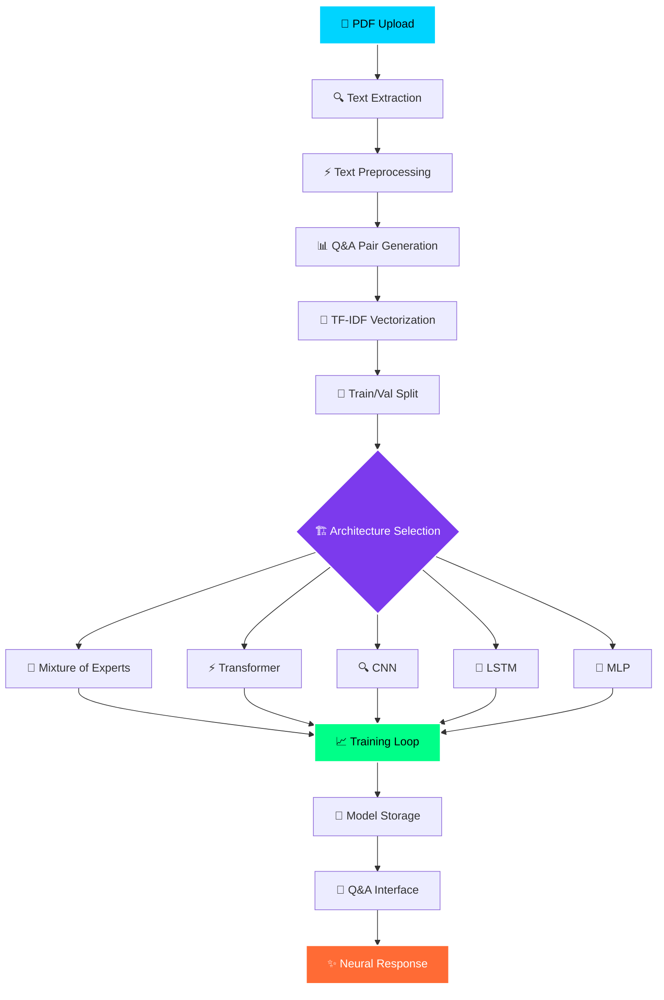
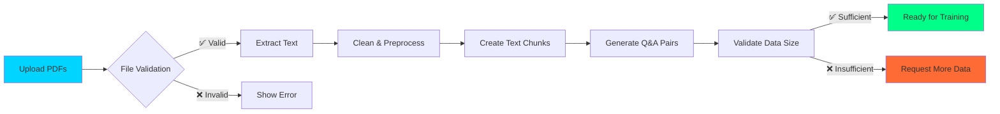
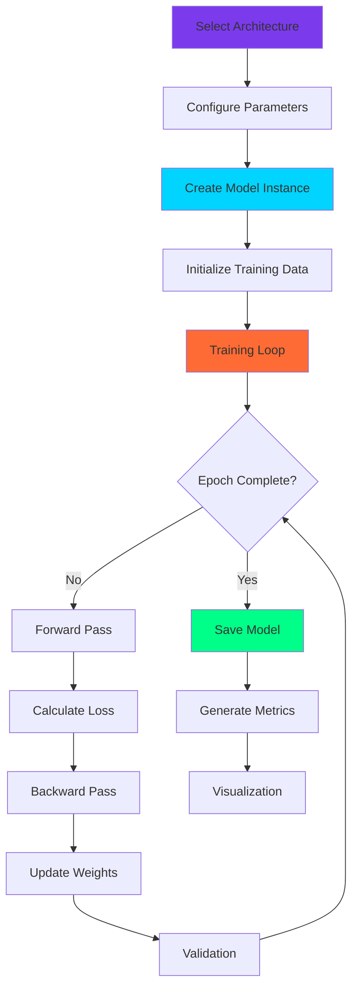
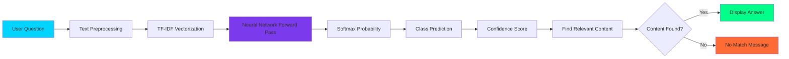
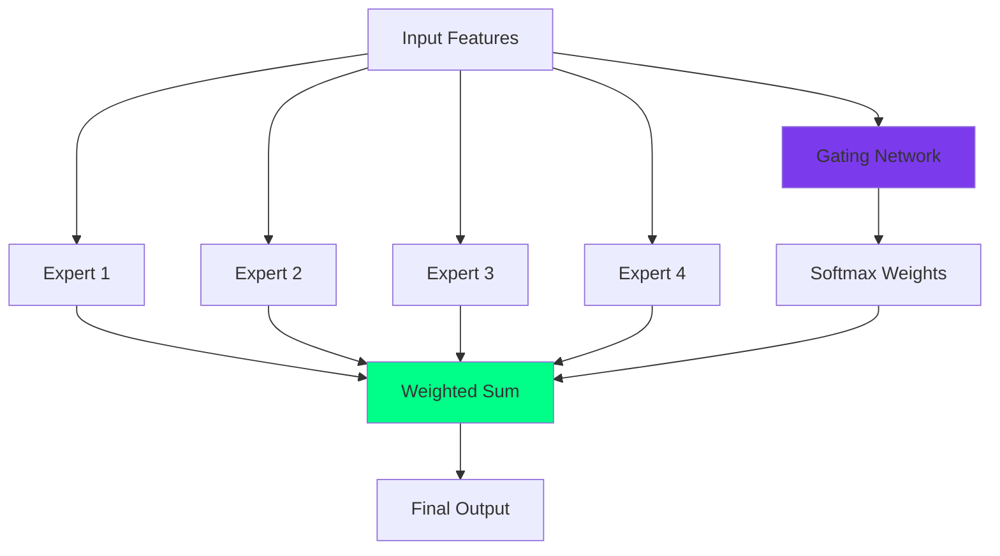
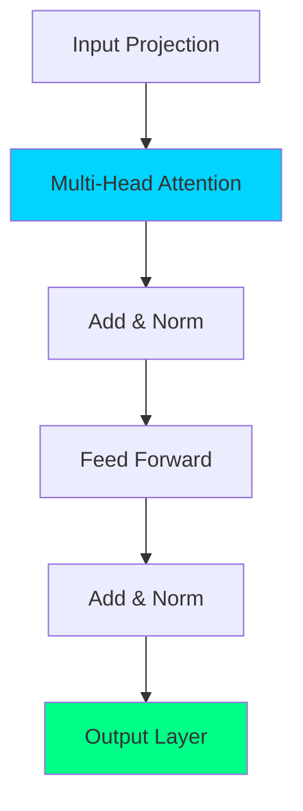
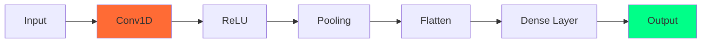

# AI-Architecture-Playground


<div align="center">


*Where artificial intelligence meets beautiful design*

**Transform your PDFs into neural training data and experiment with cutting-edge ML architectures**

[🎯 Features](#-features) • [🏗️ Architecture](#️-architecture) • [🚀 Quick Start](#-quick-start) • [📊 Workflows](#-workflows) • [🎨 Interface](#-interface)

</div>

---

## 🌟 Overview

The **ML Architecture Playground** is a sophisticated, dark-mode Streamlit application that allows users to upload PDF documents, extract text content, and train various neural network architectures for question-answering tasks. Featuring a cyberpunk-inspired interface with neon aesthetics, this tool makes machine learning experimentation both powerful and visually stunning.

## ✨ Features

### 🧠 **Neural Network Architectures**
- **Mixture of Experts (MoE)** - Advanced ensemble learning with gating mechanisms
- **Transformer** - Attention-based architecture for sequence processing
- **CNN** - Convolutional networks for pattern recognition
- **LSTM** - Long Short-Term Memory for sequential data
- **MLP** - Multi-Layer Perceptron for classic neural processing

### 📁 **Data Processing**
- **PDF Upload & Processing** - Extract and preprocess text from multiple PDFs
- **Intelligent Text Chunking** - Automatic creation of Q&A pairs
- **TF-IDF Vectorization** - Convert text to numerical features
- **Data Validation** - Ensure sufficient data for training

### 🎨 **Beautiful Interface**
- **Dark Mode Optimized** - Eye-friendly neon color scheme
- **Futuristic Design** - Cyberpunk/transformer aesthetics
- **Interactive Elements** - Animated buttons, progress bars, and status indicators
- **Real-time Feedback** - Live training progress and metrics

### 🔬 **Advanced Analytics**
- **Training Visualization** - Real-time loss curves and metrics
- **Model Comparison** - Side-by-side performance analysis
- **Confidence Scoring** - Neural network prediction confidence
- **Interactive Q&A** - Test trained models with custom questions

---

## 🏗️ Architecture Overview



## 🚀 Quick Start

### Prerequisites

```bash
pip install streamlit torch torchvision scikit-learn pandas numpy matplotlib PyPDF2
```

### Installation & Launch

1. **Clone the repository**
   ```bash
   git clone <repository-url>
   cd ml-architecture-playground
   ```

2. **Install dependencies**
   ```bash
   pip install -r requirements.txt
   ```

3. **Launch the application**
   ```bash
   streamlit run app.py
   ```

4. **Open your browser** and navigate to `http://localhost:8501`

---

## 📊 Detailed Workflows

### 1. 📁 Data Processing Workflow



### 2. 🧠 Neural Training Workflow



### 3. 🤖 Q&A Inference Workflow



---

## 🎨 Interface Components

### 🎛️ **Neural Control Center (Sidebar)**
- **Architecture Selection** - Choose from 5 different neural networks
- **Hyperparameter Tuning** - Adjust hidden dimensions, epochs, batch size
- **System Status** - Real-time indicators and model information
- **Training Configuration** - Visual parameter display

### 📂 **Data Upload Tab**
- **Multi-file PDF Upload** - Drag & drop interface
- **Processing Status** - Real-time feedback with progress indicators
- **Data Statistics** - Text length, sample count, file metrics
- **Sample Preview** - Display processed Q&A pairs

### 🧪 **Training Laboratory Tab**
- **Model Architecture Info** - Detailed descriptions and parameters
- **Real-time Training Progress** - Animated progress bars and metrics
- **Performance Visualization** - Interactive loss curves
- **Model Storage** - Track and manage trained models

### 🤖 **Q&A Testing Interface**
- **Model Selection** - Choose from trained neural networks
- **Interactive Query Input** - Natural language question interface
- **Neural Response Display** - Formatted answers with confidence scores
- **Example Questions** - Quick-test buttons for sample queries

---

## 🏛️ Neural Network Architectures

### 🧠 Mixture of Experts (MoE)
**Advanced ensemble learning with intelligent gating**



### ⚡ Simple Transformer
**Attention-based architecture for sequence understanding**



### 🔍 Convolutional Neural Network
**Pattern recognition through convolution layers**



---

## 📈 Performance Metrics

The application tracks comprehensive metrics during training and inference:

- **Training Loss** - Model learning progress over epochs
- **Validation Loss** - Generalization performance tracking
- **Accuracy** - Classification performance metrics
- **Confidence Scores** - Neural network prediction confidence
- **Parameter Count** - Model complexity statistics
- **Training Time** - Performance benchmarking

---

## 🎯 Use Cases

### 📚 **Academic Research**
- Experiment with different neural architectures
- Compare model performance on custom datasets
- Rapid prototyping for research papers

### 🏢 **Business Intelligence**
- Process company documents for Q&A systems
- Create internal knowledge bases
- Automate document analysis workflows

### 🎓 **Educational Tool**
- Learn neural network architectures interactively
- Visualize training processes in real-time
- Understand ML concepts through hands-on experience

### 💼 **Professional Development**
- Practice with state-of-the-art ML techniques
- Build portfolio projects with visual appeal
- Experiment with neural network design

---

## 🔧 Technical Implementation

### **Core Technologies**
- **Streamlit** - Web application framework
- **PyTorch** - Neural network implementation
- **Scikit-learn** - Text processing and vectorization
- **PyPDF2** - PDF text extraction
- **Matplotlib** - Training visualization

### **Neural Network Features**
- **Dynamic Architecture Creation** - Runtime model instantiation
- **Custom Training Loops** - Flexible optimization procedures
- **State Management** - Persistent model and data storage
- **Error Handling** - Robust data validation and error recovery

### **UI/UX Features**
- **CSS Custom Styling** - Dark mode optimization
- **Responsive Design** - Multi-device compatibility
- **Interactive Elements** - Hover effects and animations
- **Real-time Updates** - Dynamic progress tracking

---

## 📝 Code Structure

```
ml-architecture-playground/
├── app.py                 # Main Streamlit application
├── requirements.txt       # Python dependencies
├── README.md             # This documentation
├── models/
│   ├── experts.py        # Mixture of Experts implementation
│   ├── transformer.py    # Transformer architecture
│   ├── cnn.py           # CNN implementation
│   ├── lstm.py          # LSTM implementation
│   └── mlp.py           # MLP implementation
├── utils/
│   ├── data_processing.py # PDF and text processing
│   ├── training.py       # Training utilities
│   └── visualization.py  # Plotting functions
└── assets/
    ├── styles.css        # Custom CSS styling
    └── images/           # UI images and icons
```

---

## 🚦 Getting Started Guide

### Step 1: Upload Your Data 📁
1. Navigate to the "Data Upload" tab
2. Click or drag PDF files to upload
3. Click "Process Neural Data" to extract and prepare text
4. Verify the generated Q&A pairs look correct

### Step 2: Train Your Model 🧪
1. Go to the "Model Training" tab  
2. Select your preferred neural architecture
3. Adjust hyperparameters in the sidebar
4. Click "Initialize Neural Training" to begin
5. Watch the real-time progress and metrics

### Step 3: Test Intelligence 🤖
1. Switch to the "Q&A Testing" tab
2. Select your trained model
3. Type a question about your documents
4. Get neural-powered answers with confidence scores
5. Try the example questions for quick testing

---

## 🤝 Contributing

We welcome contributions! Please feel free to submit pull requests, report bugs, or suggest features.

### Development Setup
1. Fork the repository
2. Create a feature branch
3. Make your changes
4. Test thoroughly
5. Submit a pull request

---

## 📄 License

This project is licensed under the MIT License - see the [LICENSE](LICENSE) file for details.

---

## 🙏 Acknowledgments

- **PyTorch Team** for the excellent deep learning framework
- **Streamlit** for making beautiful web apps accessible
- **Open Source Community** for inspiration and tools

---

<div align="center">

**Made with ❤️ and ⚡ neural networks**

*Transform your documents into intelligent systems*

[](https://github.com/username/ml-architecture-playground)
[](https://github.com/username/ml-architecture-playground/fork)

</div>
